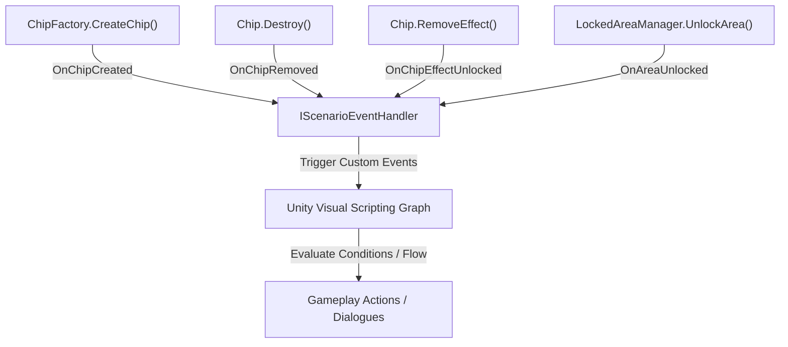

[← На Головну](../Main.md)

# Scenario System (Система сценаріїв та квестів)

Цей документ описує архітектуру для створення сюжетних сценаріїв, туторіалів та квестів у Merge з використанням **Unity Visual Scripting (UVS)** та івент-орієнтованого підходу.

---

## 1. Архітектурний огляд

Система сценаріїв інтегрується з ігровим полем та життєвим циклом чіпів, транслюючи низькорівневі зміни у високорівневі івенти, на які реагує візуальний скриптинг.



---

## 2. Інтерфейс IScenarioEventHandler

Для передачі подій у Visual Scripting використовується C# контракт `IScenarioEventHandler`. Він виступає сполучною ланкою між ядром Merge та графом UVS.

### Специфікація інтерфейсу:

```csharp
using System;

namespace Expecto.MergeBase
{
    /// <summary>
    /// Contract for scenario and quest event handling.
    /// Dispatches key board state transitions to scenario listeners.
    /// </summary>
    public interface IScenarioEventHandler
    {
        /// <summary>
        /// Triggered after a new chip is fully created and placed on the board.
        /// </summary>
        event Action<Chip> OnChipCreated;

        /// <summary>
        /// Triggered at the beginning of chip destruction, before cells are cleared.
        /// </summary>
        event Action<Chip> OnChipRemoved;

        /// <summary>
        /// Triggered when an active effect blocker is successfully destroyed from a chip.
        /// </summary>
        /// <param name="chip">The chip that was unlocked.</param>
        /// <param name="effectId">The ID of the removed blocker effect (from EffectConsts.Blockers).</param>
        event Action<Chip, int> OnChipEffectUnlocked;

        /// <summary>
        /// Triggered when a locked area is unlocked and all its deferred chips are spawned.
        /// </summary>
        /// <param name="areaId">The unique ID of the unlocked area (from FieldData.LockedAreas).</param>
        event Action<int> OnAreaUnlocked;
    }
}
```

---

## 3. Джерела подій (Event Sources)

Генерація подій вбудована у відповідні життєві цикли ядра Merge2.

### 3.1 Створення чіпа (`OnChipCreated`)

- **Метод `ChipFactory.CreateChip()`** викликає `scenarioEventHandler.RaiseChipCreated(chip, cell)` після успішної ініціалізації та розміщення чіпа на полі через `SetChipInCell()`.
- Це гарантує, що чіп повністю готовий, розміщений на сітці та має актуальну клітинку.

### 3.2 Видалення чіпа (`OnChipRemoved`)

- **Метод `Chip.Destroy()`** викликає `scenarioEventHandler.RaiseChipRemoved(this)` на самому початку виконання, перед очищенням клітинок сітки та фактичним знищенням GameObject.
- Це дозволяє підписникам зчитати поточний стан та координати чіпа перед його видаленням.

### 3.3 Розблокування чіпа від ефекту (`OnChipEffectUnlocked`)

- **Метод `Chip.RemoveEffect()`** викликає `scenarioEventHandler.RaiseChipEffectUnlocked(this, effectId)` після очищення ефекту зі словника активних ефектів, зняття блокувань (`CombinedBlockingState`) та оновлення візуалу чіпа.

### 3.4 Розблокування зони (`OnAreaUnlocked`)

- **Метод `LockedAreaManager.UnlockArea()`** викликає `scenarioEventHandler.RaiseAreaUnlocked(areaId)` після відкриття клітинок зони, спавну всіх відкладених фішок через `ChipFactory` та деактивації візуальних ефектів блокування (туман/ворота).

---

## 4. Реалізація ScenarioEventHandler (VContainer)

Клас `ScenarioEventHandler` є C# синглтоном і реєструється у `Merge2LifetimeScope` та `IsoMergeLifetimeScope`:

```csharp
builder.Register<ScenarioEventHandler>(Lifetime.Singleton).As<IScenarioEventHandler>();
```

Під час ініціалізації (`Merge2Initializer` та `IsoMergeInitializer`):
1. `ChipFactory` отримує посилання на `IScenarioEventHandler` за допомогою методу `Init()`.
2. Менеджер заблокованих зон `LockedAreaManager` отримує залежність через DI.
3. Посилання на `ILockedAreaManager` реєструється у локальних `Variables` компонента `ScriptMachine` (GameObject), що дозволяє UVS вузлам взаємодіяти із менеджером зон.

---

## 5. Інтеграція з Visual Scripting

Для створення сюжетів у UVS реалізовано кастомні вузли подій та дій:

### Вузли подій (UVS Event Units):
- **`Wait For Chip Created` (`WaitForChipCreatedNode`)**: Призупиняє виконання графу, доки не буде створено чіп (опціонально порівнюється з очікуваним `ChipData`).
- **`Wait For Chip Removed` (`WaitForChipRemovedNode`)**: Призупиняє виконання, доки чіп певного типу не буде знищено.
- **`Wait For Chip Effect Unlocked` (`WaitForChipEffectUnlockedNode`)**: Очікує зняття конкретного ефекту-блокатора з чіпа.
- **`Wait For Area Unlocked` (`WaitForAreaUnlockedNode`)**: Очікує розблокування певної зони сітки.

### Вузли дій (UVS Action Units):
- **`Unlock Area` (`UnlockAreaNode`)**: Команда на розблокування зони з вказаним ID (із можливістю форсованого відкриття `forceUnlock`).

---

## 6. Типові сценарії використання (Use Cases)

| Сценарій | Логіка виконання | Подія-тригер |
| :--- | :--- | :--- |
| **Навчання (Tutorial)** | Підсвітити клітинку, чекати створення чіпа певного типу, показати діалог. | `OnChipCreated` |
| **Квест "Очисти поле"** | Заблокувати вихід з рівня, поки на полі є заблоковані ланцюгами чіпи. | `OnChipEffectUnlocked` |
| **Бос або Скриня** | При знищенні (видаленні) чіпа-перешкоди спавнити нагороду. | `OnChipRemoved` |
| **Прогресія рівня** | Після розблокування нової зони показати діалог або анімацію. | `OnAreaUnlocked` |
