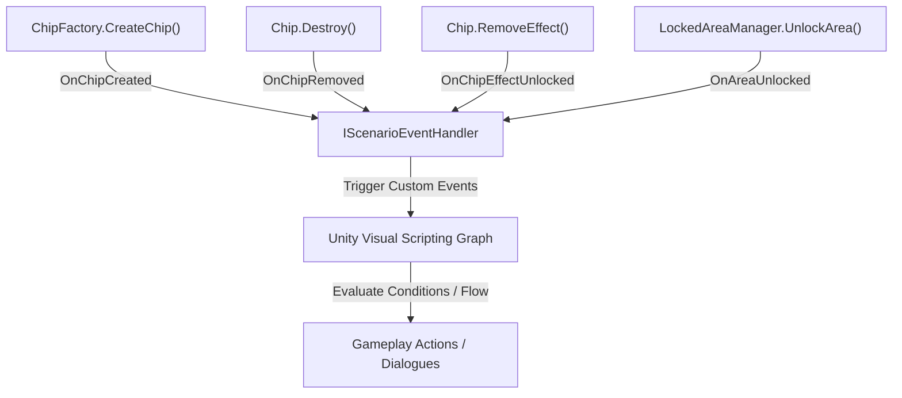

[← На Головну](../Main.md)

# Scenario System

Цей документ описує архітектуру для створення сюжетних сценаріїв, туторіалів та квестів у Merge з використанням **Unity Visual Scripting (UVS)** та івент-орієнтованого підходу.

---

## 1. Architectural Overview

Система сценаріїв інтегрується з ігровим полем та життєвим циклом чіпів, транслюючи низькорівневі зміни у високорівневі івенти, на які реагує візуальний скриптинг.


```mermaid
graph TD
    ChipFactory["ChipFactory.CreateChip()"] -->|OnChipCreated| ScenarioEventHandler
    ChipDestroy["Chip.Destroy()"] -->|OnChipRemoved| ScenarioEventHandler
    TryDestroyEffect["Chip.RemoveEffect()"] -->|OnChipEffectUnlocked| ScenarioEventHandler
    LockedAreaMgr["LockedAreaManager.UnlockArea()"] -->|OnAreaUnlocked| ScenarioEventHandler
    ScenarioEventHandler[IScenarioEventHandler] -->|Trigger Custom Events| UVS[Unity Visual Scripting Graph]
    UVS -->|Evaluate Conditions / Flow| GameplayActions[Gameplay Actions / Dialogues]
```

---

## 2. IScenarioEventHandler Interface

Для передачі подій у Visual Scripting використовується C# контракт `IScenarioEventHandler`. Він виступає сполучною ланкою між ядром Merge та графом UVS.

### 2.1 Interface Specification

```csharp
using System;

namespace Expecto.MergeBase
{
    /// <summary>
    /// Contract for scenario and quest event handling.
    /// Dispatches key board state transitions to scenario listeners.
    /// </summary>
    public interface IScenarioEventHandler
    {
        /// <summary>
        /// Triggered after a new chip is fully created and placed on the board.
        /// </summary>
        event Action<Chip> OnChipCreated;

        /// <summary>
        /// Triggered at the beginning of chip destruction, before cells are cleared.
        /// </summary>
        event Action<Chip> OnChipRemoved;

        /// <summary>
        /// Triggered when a chip is tapped by the user.
        /// </summary>
        event Action<Chip> OnChipTapped;

        /// <summary>
        /// Triggered when chip generation or evolution fails due to lack of free cells on the board.
        /// </summary>
        event Action<Chip> OnNotEnoughSpace;

        /// <summary>
        /// Triggered when an active effect blocker is successfully destroyed from a chip.
        /// </summary>
        /// <param name="chip">The chip that was unlocked.</param>
        /// <param name="effectId">The ID of the removed blocker effect (from EffectConsts.Blockers).</param>
        event Action<Chip, int> OnChipEffectUnlocked;

        /// <summary>
        /// Triggered when a locked area is unlocked and all its deferred chips are spawned.
        /// </summary>
        /// <param name="areaId">The unique ID of the unlocked area (from FieldData.LockedAreas).</param>
        event Action<int> OnAreaUnlocked;
    }
}
```

---

## 3. Event Sources

Генерація подій вбудована у відповідні життєві цикли ядра Merge2.

### 3.1 Chip Creation (OnChipCreated)

- **Метод `ChipFactory.CreateChip()`** викликає `scenarioEventHandler.RaiseChipCreated(chip, cell)` після успішної ініціалізації та розміщення чіпа на полі через `SetChipInCell()`.
- Це гарантує, що чіп повністю готовий, розміщений на сітці та має актуальну клітинку.

### 3.2 Chip Removal (OnChipRemoved)

- **Метод `Chip.Destroy()`** викликає `scenarioEventHandler.RaiseChipRemoved(this)` на самому початку виконання, перед очищенням клітинок сітки та фактичним знищенням GameObject.
- Це дозволяє підписникам зчитати поточний стан та координати чіпа перед його видаленням.

### 3.3 Chip Tapping (OnChipTapped)

- **Метод `Chip.OnTap()`** викликає `scenarioEventHandler.RaiseChipTapped(this)` під час користувацького тапу по чіпу (до виклику модулів та ефектів).

### 3.4 Chip Effect Unlocking (OnChipEffectUnlocked)

- **Метод `Chip.RemoveEffect()`** викликає `scenarioEventHandler.RaiseChipEffectUnlocked(this, effectId)` після очищення ефекту зі словника активних ефектів, зняття блокувань (`CombinedBlockingState`) та оновлення візуалу чіпа.

### 3.5 Area Unlocking (OnAreaUnlocked)

- **Метод `LockedAreaManager.UnlockArea()`** викликає `scenarioEventHandler.RaiseAreaUnlocked(areaId)` після відкриття клітинок зони, спавну всіх відкладених фішок через `ChipFactory` та деактивації візуальних ефектів блокування (туман/ворота).

---

## 4. ScenarioEventHandler Implementation

Клас `ScenarioEventHandler` є C# синглтоном і реєструється у `Merge2LifetimeScope` та `IsoMergeLifetimeScope` як реалізація `IScenarioEventHandler`:

```csharp
builder.Register<ScenarioEventHandler>(Lifetime.Singleton).As<IScenarioEventHandler>();
```

Він відповідає за C# події (`OnChipCreated`, `OnChipRemoved`, `OnChipTapped`, `OnChipEffectUnlocked`, `OnAreaUnlocked`) та не має жодних залежностей від Unity Visual Scripting.

---

## 5. Visual Scripting Integration (UVS)

Вся інтеграція з Unity Visual Scripting винесена в окрему збірку `MergeBase.VScripting.asmdef` (у папці `Assets/Expecto/MergeBase/VScripting`), що дозволяє тримати ядро Merge повністю незалежним від пакета `com.unity.visualscripting`.

Для підключення UVS використовується додатковий дочірній контейнер залежностей `MergeBaseVScriptingLifetimeScope`, який:
1. Реєструє посилання на сцену `ScriptMachine`.
2. Реєструє адаптер `VScriptingScenarioEventBridge` як `Singleton`.
3. Реєструє точку входу `MergeBaseVScriptingInitializer`.

### 5.1 Event Bridge (VScriptingScenarioEventBridge)

Адаптер підписується на події `IScenarioEventHandler` та `IFieldEventHandler`, транслюючи їх в `EventBus` Visual Scripting:

```csharp
public void Initialize()
{
	scenarioEventHandler.OnChipCreated += (chip) =>
		EventBus.Trigger("OnChipCreated", new ChipCreatedEventArgs { Chip = chip });

	scenarioEventHandler.OnChipRemoved += (chip) =>
		EventBus.Trigger("OnChipRemoved", new ChipRemovedEventArgs { Chip = chip });

	scenarioEventHandler.OnChipTapped += (chip) =>
		EventBus.Trigger("OnChipTapped", new ChipTappedEventArgs { Chip = chip });

	scenarioEventHandler.OnChipEffectUnlocked += (chip, id) =>
		EventBus.Trigger("OnChipEffectUnlocked", new ChipEffectUnlockedEventArgs { Chip = chip, EffectId = id });

	scenarioEventHandler.OnAreaUnlocked += (areaId) =>
		EventBus.Trigger("OnAreaUnlocked", new AreaUnlockedEventArgs { AreaId = areaId });

	scenarioEventHandler.OnNotEnoughSpace += (chip) =>
		EventBus.Trigger("OnNotEnoughSpace", new NotEnoughSpaceEventArgs { Chip = chip });

	fieldEventHandler.OnChangeField += () =>
		EventBus.Trigger("OnChangeField");
}
```

### 5.2 Initialization (MergeBaseVScriptingInitializer)

Під час старту сцени ініціалізатор:
1. Викликає `bridge.Initialize()` для підписки на івенти та перенаправлення їх в UVS.
2. Реєструє посилання на `ILockedAreaManager`, `ITutorialManager`, `ITutorialInputBlocker`, `ChipFactory`, `IChipCollections`, `ClickAction` (`UnityEngine.InputSystem.InputAction`), `IFieldGrid` (`FieldGrid`) та `IChipMovingLogic` (`ChipMovingLogic`) у Scene Variables сцени (`Variables.Scene`), що дозволяє усім кастомним UVS-вузлам та стандартним подям у цій сцені взаємодіяти з системами:

```csharp
var declarations = Variables.Scene(scriptMachine.gameObject.scene);
declarations.Set("LockedAreaManager", lockedAreaManager);
declarations.Set("TutorialManager", tutorialManager);
declarations.Set("TutorialInputBlocker", tutorialInputBlocker);
declarations.Set("ChipFactory", chipFactory);
declarations.Set("ChipCollections", chipCollections);
declarations.Set("ClickAction", inputManager.ClickAction);
declarations.Set("FieldGrid", fieldGrid);
declarations.Set("ChipMovingLogic", chipMovingLogic);
```

### 5.3 Custom UVS Units

Для створення сюжетів у UVS реалізовано кастомні вузли подій та дій:

#### Event Units
- **`Wait For Chip Created` (`WaitForChipCreatedNode`)**: Призупиняє виконання графу, доки не буде створено чіп (опціонально порівнюється з очікуваним `ChipData`).
- **`Wait For Chip Removed` (`WaitForChipRemovedNode`)**: Призупиняє виконання, доки чіп певного типу не буде знищено.
- **`Wait For Chip Effect Unlocked` (`WaitForChipEffectUnlockedNode`)**: Очікує зняття конкретного ефекту-блокатора з чіпа.
- **`Wait For Area Unlocked` (`WaitForAreaUnlockedNode`)**: Очікує розблокування певної зони сітки.
- **`Wait For Not Enough Space` (`WaitForNotEnoughSpaceNode`)**: Очікує спроби генерації або еволюції чіпа при відсутності вільного місця на полі.
- **`Wait For Free Cells` (`WaitForFreeCellsNode`)**: Нода-корутина, що призупиняє виконання графу, доки хоча б одна з переданих прямокутних областей зі списку кандидатів `cellPositions` (`List<Vector2Int>`) заданого розміру `size` не стане вільною від чіпів або придатною для релокації.
  - **Фаза 1**: Перевіряє кандидатні позиції у порядку черги на наявність повністю вільної та незаблокованої прямокутної області.
  - **Фаза 2 (при `aggressive = true`)**: Якщо повністю вільної області немає, за допомогою `IChipMovingLogic` підбирає кандидата, що потребує мінімальної кількості релокацій (переміщень) конфліктних чіпів у вільні клітинки поля (перевірка виконується без фактичного зсуву фішок).
  - Здійснює негайну оцінку при вході в корутину (для запобігання дедлоку) та повторну оцінку після кожного спрацювання події зміни поля `OnChangeField`. Повертає обрану позицію `cellPosition`, розмір `size`, якірну клітинку `cell` та прапорець `needsRelocation`.

#### Action Units
- **`Create Chip` (`CreateChipNode`)**: Створює чіп на полі через `ChipFactory` за заданими `chipData` та `cellPosition`.
  - Підтримує опціональні налаштування польоту через інспекторний перемикач у заголовку ноди `Use Flight` (динамічно активує порти `parentWorldPosition`, `flightDuration`, `flightType`).
  - Підтримує агресивний режим (`aggressive = true`): якщо цільові клітинки зайняті, перевіряє можливість переміщення конфліктних чіпів через `IChipMovingLogic` та релокує їх у вільні клітинки перед створенням чіпа.
  - Дозволяє призначати початкові блокер-ефекти `blockerEffectIds` та анімаційний тригер `animatorTrigger`.
  - Повертає посилання на створений чіп `createdChip` (`Chip`) та булевий статус успіху виконання `success`.
- **`Unlock Area` (`UnlockAreaNode`)**: Команда на розблокування зони з вказаним ID (із можливістю форсованого відкриття `forceUnlock`).

---

## 6. Common Use Cases

| Сценарій | Логіка виконання | Подія-тригер |
| :--- | :--- | :--- |
| **Навчання (Tutorial)** | Підсвітити клітинку, чекати створення чіпа певного типу, показати діалог. | `OnChipCreated` |
| **Квест "Очисти поле"** | Заблокувати вихід з рівня, поки на полі є заблоковані ланцюгами чіпи. | `OnChipEffectUnlocked` |
| **Бос або Скриня** | При знищенні (видаленні) чіпа-перешкоди спавнити нагороду. | `OnChipRemoved` |
| **Прогресія рівня** | Після розблокування нової зони показати діалог або анімацію. | `OnAreaUnlocked` |
| **Попередження про переповнення** | Показувати підказку або UI повідомлення при спробі спавну без вільного місця. | `OnNotEnoughSpace` |
| **Підготовка зони для спавну/боса** | Очікувати звільнення прямокутної зони або можливості релокації чіпів перед спавном об'єкта. | `OnChangeField` |
