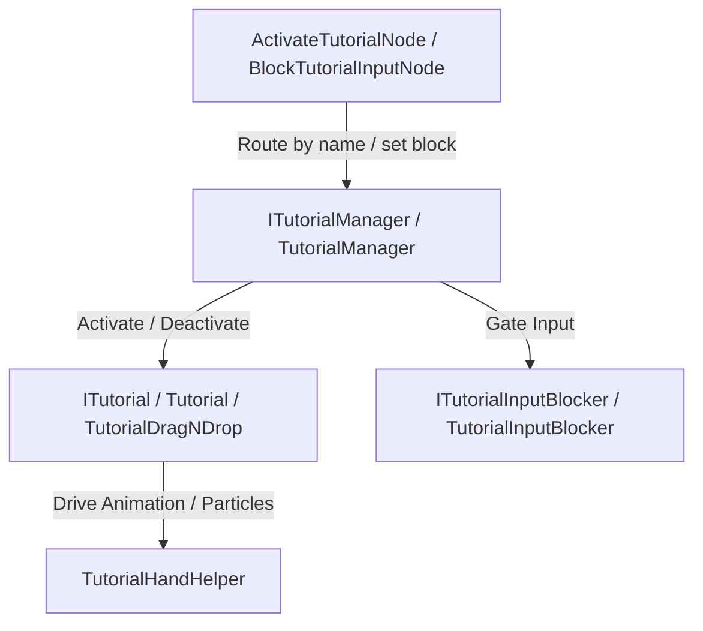

[← На Головну](../Main.md)

# Tutorial System (Система туторіалів)

Цей документ описує архітектуру системи туторіалів у Merge2, включаючи керування життєвим циклом туторіальних префабів (`ITutorialManager`), блокування вводу гравця (`ITutorialInputBlocker`), візуальні підказки руки (`TutorialHandHelper` / `TutorialDragNDrop`) та ноди Unity Visual Scripting (UVS).

---

## 1. Overview

Система туторіалів призначена для покрокового навчання гравців механікам гри. Вона реалізує:
1. Реєстрацію та запуск туторіальних префабів за ім'ям префабу (`TutorialName`).
2. Блокування поля та обмеження дій гравця конкретною клітинкою або перетягуванням (`ITutorialInputBlocker`).
3. Анімації підказки руки (`TutorialHandHelper`, `TutorialDragNDrop`).
4. Інтеграцію з графами сценаріїв Visual Scripting.

---

## 2. Core Interfaces and Classes

### 2.1 ITutorial & Tutorial

- **Файл**: [Tutorial.cs](../../Core/Scripts/Tutorials/Tutorial.cs)
- **Інтерфейс**: [ITutorial.cs](../../Core/Scripts/Tutorials/ITutorial.cs)

`ITutorial` — контракт для окремого туторіалу. Реалізується на префабі туторіалу.

**Властивості та методи**:
- `string TutorialName { get; }` — унікальне ім'я туторіалу, що повертає `gameObject.name` (має відповідати імені префабу для маршрутизації з UVS).
- `void Activate()` — активує туторіал, робить об'єкт активним та відправляє тригер `"Activate"` в `Animator`.
- `void Deactivate()` — відправляє тригер `"Deactivate"` в `Animator`.
- `void Destroy()` — викликається в кінці анімації `"Deactivate"` (зазвичай через Animation Event), скасовує реєстрацію в `ITutorialManager` та знищує GameObject туторіалу.

### 2.2 ITutorialManager & TutorialManager

- **Файл**: [TutorialManager.cs](../../Core/Scripts/Tutorials/TutorialManager.cs)
- **Інтерфейс**: [ITutorialManager.cs](../../Core/Scripts/Tutorials/ITutorialManager.cs)

Singleton-сервіс, який реєструється у `Merge2LifetimeScope` і керує активним туторіалом.

**Властивості та події**:
- `ITutorial ActiveTutorial { get; }` — поточний активний екземпляр туторіалу (або `null`).
- `event Action<string> OnTutorialDeactivated` — подія, яка викликається при деактивації туторіалу та передає його ім'я.

**Основні методи**:
- `void RegisterTutorial(ITutorial tutorial)` — реєструє екземпляр туторіалу в словнику за ім'ям `TutorialName`.
- `void UnregisterTutorial(ITutorial tutorial)` — видаляє туторіал із реєстрації.
- `void Activate(string tutorialName)` — деактивує поточний активний туторіал (якщо є) і запускає туторіал за вказаним ім'ям.
- `void Deactivate()` — деактивує поточний `ActiveTutorial` та викликає подібну подію `OnTutorialDeactivated`.

### 2.3 TutorialHandHelper

- **Файл**: [TutorialHandHelper.cs](../../Core/Scripts/Tutorials/TutorialHandHelper.cs)

Допоміжний компонент для візуалізації підказок руки на дочірньому об'єкті префабу.

**Методи**:
- `void SendTrigger(string triggerName)` — відправляє тригер в `handAnimator` (наприклад, для анімації тапу чи вказівки).
- `void PlayParticle()` — запускає систему частинок `handParticle`.
- `void StopParticleEmission()` — припиняє емісію частинок `handParticle`.

---

## 3. Input Blocking System

### 3.1 ITutorialInputBlocker & TutorialInputBlocker

- **Файл**: [TutorialInputBlocker.cs](../../Core/Scripts/Tutorials/TutorialInputBlocker.cs)
- **Інтерфейс**: [ITutorialInputBlocker.cs](../../Core/Scripts/VContainer/Interfaces/ITutorialInputBlocker.cs)

Сервіс блокування вводу, що реєструється в `Merge2LifetimeScope` і перевіряється в `DraggableChipLogic` та `FieldEventHandler`.

**Властивості**:
- `bool IsBlocked { get; }` — прапорець активного блокування поля.
- `Vector2Int? AllowedStart { get; }` — координата верхньої-лівої клітинки, з якої дозволено дію (`null` = без виключень, все заблоковано).
- `Vector2Int? AllowedEnd { get; }` — координата цільової клітинки завершення перетягування.
- `Vector2Int? IsTapMode { get; }` — `true`, коли `AllowedStart == AllowedEnd` (дозволено лише тап по клітинці, перетягування заблоковано).

**Методи**:
- `void BlockInput(Vector2Int? allowedStart, Vector2Int? allowedEnd)` — вмикає блокування та зберігає дозволені координати дій.
- `void UnblockInput()` — вимикає блокування вводу та скидає дозволені позиції на `null`.

---

## 4. Visual Scripting Integration (UVS) & Special Tutorial Classes

### 4.1 Action Nodes

- **`ActivateTutorialNode`** ([ActivateTutorialNode.cs](../../VScripting/Scripts/Actions/ActivateTutorialNode.cs)): Викликова нода-корутина. Викликає `manager.Activate(tutorialName)` і призупиняє виконання графа до виклику події `OnTutorialDeactivated` із відповідним ім'ям.
- **`DeactivateTutorialNode`** ([DeactivateTutorialNode.cs](../../VScripting/Scripts/Actions/DeactivateTutorialNode.cs)): Викликає `manager.Deactivate()`.
- **`BlockTutorialInputNode`** ([BlockTutorialInputNode.cs](../../VScripting/Scripts/Actions/BlockTutorialInputNode.cs)): Встановлює обмежувальні координати дій `allowedStart` та `allowedEnd` через `ITutorialInputBlocker`. Значення `(-1, -1)` використовується як сентинель для `null` (повне блокування).
- **`UnblockTutorialInputNode`** ([UnblockTutorialInputNode.cs](../../VScripting/Scripts/Actions/UnblockTutorialInputNode.cs)): Викликає `blocker.UnblockInput()`.

### 4.2 TutorialDragNDrop

- **Файл**: [TutorialDragNDrop.cs](../../VScripting/Scripts/Tutorials/TutorialDragNDrop.cs)

Спеціалізований нащадок `Tutorial`, що реалізує анімоване переміщення підказки руки між клітинками поля та інтеграцію із Visual Scripting:
- **Серіалізовані налаштування**: `startDragPos`, `endDragPos`, `waitDestroyChip`, `handTransform`, `dragDuration`, `movementCurve`, `arcHeight`, `arcCurve`.
- **`Activate()`**: Позиціонує `handTransform` у світові координати центру клітинки `startDragPos`.
- **`StartHandDrag()`**: Запускає корутину анімації переміщення руки по дузі до `endDragPos` за час `dragDuration` (зазвичай викликається через Animation Event в AnimatorController префабу).

### 4.3 VariablesTransfer

- **Файл**: [VariablesTransfer.cs](../../VScripting/Scripts/Tutorials/VariablesTransfer.cs)

Допоміжний компонент MonoBehaviour, що використовується на префабах туторіалів для переносу змінних Visual Scripting.

- **`TransferVariables(VariableDeclarations sourceDeclarations)`**: Ітерується по вхідних оголошеннях змінних `sourceDeclarations` і копіює кожне ім'я та значення в локальний контекст об'єкта `Variables.Object(gameObject)`.
